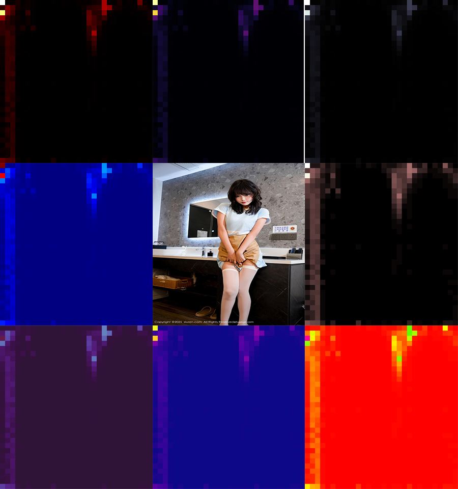
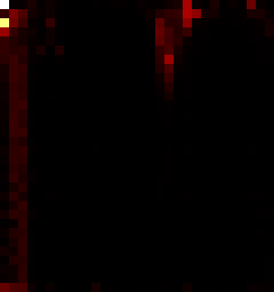

# HSV色彩空间二维直方图学习笔记

* 前言  

1. RGB的**光强敏感性**

   RGB是加色模型，红、绿、蓝三个通道的数值直接与光的强度挂钩：

   • 光强提升时，三个通道的数值会同步增大（比如白色墙面在强光下RGB值接近(255,255,255)，弱光下接近(100,100,100)）；

   • **同一物体在不同光照下**，RGB值会发生显著变化，导致基于RGB的直方图检索、**特征匹配结果偏差极大**。

2. HSV的抗光强优势

   HSV将色彩信息拆分为色调（H）、饱和度（S）、明度（V）三个独立维度：

  • H通道：仅表示色彩种类（如红色、绿色），完全不受光强影响；

  • S通道：表示色彩鲜艳程度，受光强的影响也远小于RGB；

  • V通道：**专门对应光强**，**可直接剔除该通道仅用H+S做特征**，**彻底避开光强干扰**。

   **这也是在图片检索、色彩识别等场景中，优先选择HSV而非RGB的核心原因。**

## 一、二维直方图的优势与用处

### 1. 核心优势

相比一维直方图（仅统计单一通道的像素分布），HSV二维直方图（选取H色调+S饱和度通道）**能同时反映两个通道的像素联合分布特征**，可更**精准**地描述图像的色彩信息，有效避免**一维直方图因通道独立统计导致的色彩特征混淆问题**。

### 2. 主要用途

 色彩**特征提取**：用于图像**检索**、**分类**，通过对比不同图像的二维直方图**相似度**判断色彩**一致性**。

 目标**检测与跟踪**：针对**特定色彩**的目标（如**红色车辆**、**绿色植物**），可通过直方图匹配**定位**目标区域。

 图像**分割**：结合直方图的**峰值**与**谷值**，划分不同色彩的像素区域，实现**前景**与**背景**分离。

## 二、代码模块化分析

### 1. 色彩空间的转换

~~~c++
Mat hsv, hs_hist;
cvtColor(image, hsv, COLOR_BGR2HSV);
~~~

调用`cvtColor`将BGR格式图像转换为HSV格式，HSV空间更符合人眼对色彩的感知规律，H、S通道关联性强，适合联合统计。

### 2. 直方图参数配置

~~~c++
nt h_bins = 30;  // 色调通道分箱数
int s_bins = 32;  // 饱和度通道分箱数
int histSize[] = { h_bins,s_bins };
float h_ranges[] = { 0,180 };  // H通道取值范围
float s_ranges[] = { 0,256 };  // S通道取值范围
const float* ranges[] = { h_ranges,s_ranges };
int channels[] = { 0,1 };  // 选取H(0)、S(1)通道
~~~

分箱数决定直方图精度（分箱越多特征越精细，计算量也越大）；取值范围严格匹配HSV通道值域，保证统计无遗漏。

### 3. 二位直方图的计算

~~~c++
calcHist(&hsv, 1, channels, Mat(), hs_hist, 2, histSize, ranges, true, false);
~~~

参数作用说明

`&HSV`输入图像指针

`1` 输入图像数量

`channels` 指定参数计算通道索引

`Mat()` 无**掩码**，传空矩阵 

`hs_hist` 输出的二维直方图结果矩阵 

`2 `直方图维度（二维） 
`histSize` 各维度分箱数 
`ranges` 各通道取值范围 
`true` 直方图归一化 
`false `不累积计算多幅图像直方图 

### 4. 直方图归一化与可视化图像创建

~~~c++
double maxVal = 0;
minMaxLoc(hs_hist, 0, &maxVal, 0, 0);
int scale = 10;
Mat hs_hist_img = Mat::zeros(s_bins * scale, h_bins * scale, CV_8UC3);
~~~

**minMaxLoc**提取直方图**最大值**，用于后续绘制图片

### 5. 绘制直方图可视化图像

~~~c++
for (int h = 0; h < h_bins; h++)
{
    for (int s = 0; s < s_bins; s++)
    {
        float binVal = hs_hist.at<float>(h, s);
        int intensity = cvRound(binVal * 255 / maxVal);
        rectangle(hs_hist_img, Point(h * scale, s * scale),
            Point((h + 1) * scale - 1, (s + 1) * scale - 1),
            Scalar::all(intensity), FILLED);
    }
}
~~~

双层循环遍历每个直方图bin，通过at`<float>`获取像素统计值；归一化后的i**ntensity**对应矩形亮度（**亮度越高**，**该H-S组合的像素数量越多**）；**rectangle**绘制填充矩形完成**灰度可视化**。

## 三、实验结果分析

**实验结果**

### 1. 直方图外观特征

 **整体结构**：呈现**网格状分布**，**横向**（X轴）代表**H（色调**）维度（30个bins），**纵向**（Y轴）**代表S（饱和度）**维度（32个bins）
 **颜色映射**：使用了某种colormap（可能是JET或HOT）来可视化频率值，暖色（红/黄）表示高频区域，冷色（蓝/紫）表示低频区域
 分布模式：**有明显的集中区域和稀疏区域**

### 2. 颜色分布分析

 高密度区域（热点）：

 图像中存在**几个明显的亮点区域**，**表明某些特定的色调-饱和度组合在图像中出现频率很高**
 这些热点可能对应：
 **图像中的主要物体颜色**
 **大面积的背景色**
 **重复的纹理或图案**

 分布特征：

1.  饱和度分布：
       1. 如果热点集中在**高饱和度区域（Y轴上方）**→ **图像色彩鲜艳**
       2. 如果热点分布在**低饱和度区域（Y轴下方）**→ **图像色彩柔和或偏灰**

2. 色调分布：
   1. 热点在**X轴上的位置对应具体的色调值**
   2. 如果热点集中在**小范围色调区间** → 图像**主色调明确**
   3. 如果热点分散在**多个色调区间** → 图像**色彩丰富**

### 3. 实验结果解读

 可能的图像特征：

 **主色调明显**：从直方图中可以看到**1-2个**主要的**热点区域**，说明图像有**1-2种主导颜色**

 **色彩纯度中等**：热点在**中高饱和度区域**，**说明颜色比较鲜明但不过分鲜艳**
 颜色**结构清晰**：**热点分布较为集中**，表明图像中**颜色区域划分明确**

 应用意义：

1. **颜色特征提取成功**：直方图清晰地捕捉到了**图像的颜色分布模式**
2. **可用于图像匹配**：这种直方图可以作为图像的**"颜色指纹"**，用于相似**图像检索**
3. **分割基础**：**高密度区域对应的HSV范围可用于颜色分割阈值的选择**

### 4. 技术验证

  算法正确性：直方图显示了合理的二维分布，验证了`calcHist`函数计算准确
  可视化效果：通过colormap映射，频率信息被有效转换为视觉信息
  参数合理性：30×32的分bin数量既保证了细节分辨率，又避免了过度碎片化

  这个实验成功展示了如何从图像中提取并可视化HSV颜色分布特征，为进一步的图像分析和处理奠定了基础。
